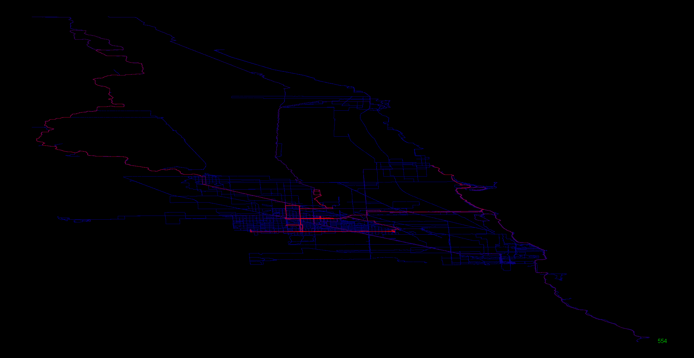
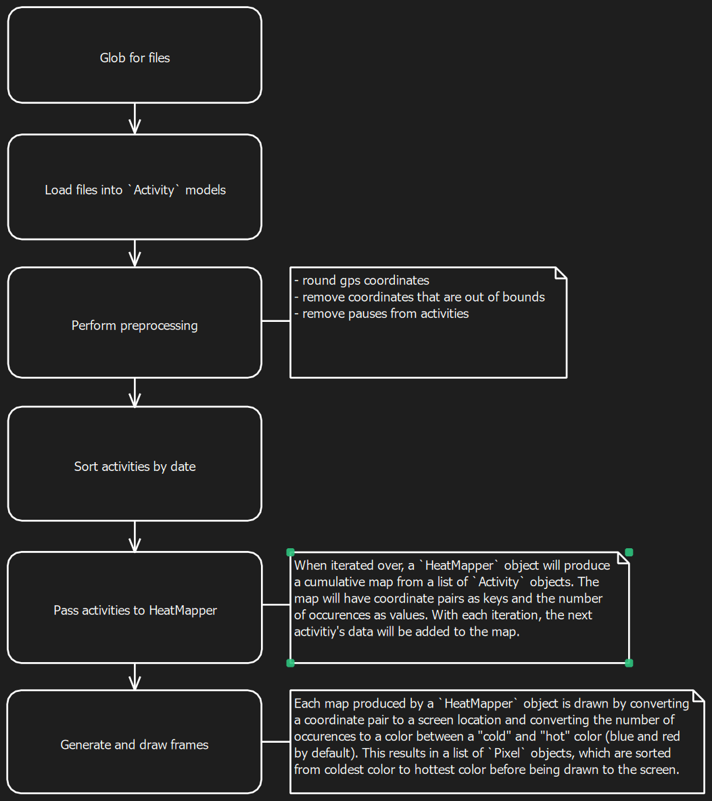

# HeatMapper



A java app for making heat map animations from `.fit` and `.gpx` files.

## Requirements

- Java 21

## Build Requirements

- Java 21
- Maven

## Running HeatMapper

Download:

```console
git clone https://github.com/matt-manes/HeatMapper
```

Run with included sample data:

```console
java -jar ./out/HeatMapper.jar
```

To use your own data (downloaded from strava or a device), provide the directory as a command line argument:

```console
java -jar ./out/HeatMapper.jar some/path/containing/files
```

The first time HeatMapper is run, a `settings.json` file will be generated and populated with default values:

```json
{
  "coordinateBounds": {
    "west": -87.8,
    "east": -87.570721,
    "south": 41.791163,
    "north": 42.153288
  },
  "penRadius": 0.0001,
  "gpsPrecision": 4,
  "animationFrameWaitMS": 0,
  "canvasSize": {
    "width": 0.99,
    "height": 0.91
  },
  "colors": {
    "hot": {
      "r": 255,
      "b": 0,
      "g": 0
    },
    "background": {
      "r": 0,
      "b": 0,
      "g": 0
    },
    "cold": {
      "r": 0,
      "b": 125,
      "g": 0
    }
  },
  "fileTypes": [
    ".fit",
    ".fit.gz",
    ".gpx"
  ],
  "colorCompression": 0.995,
  "dataPath": "data\\activities"
}
```

## Processing flow


